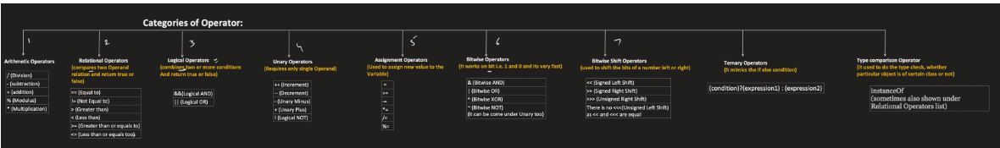
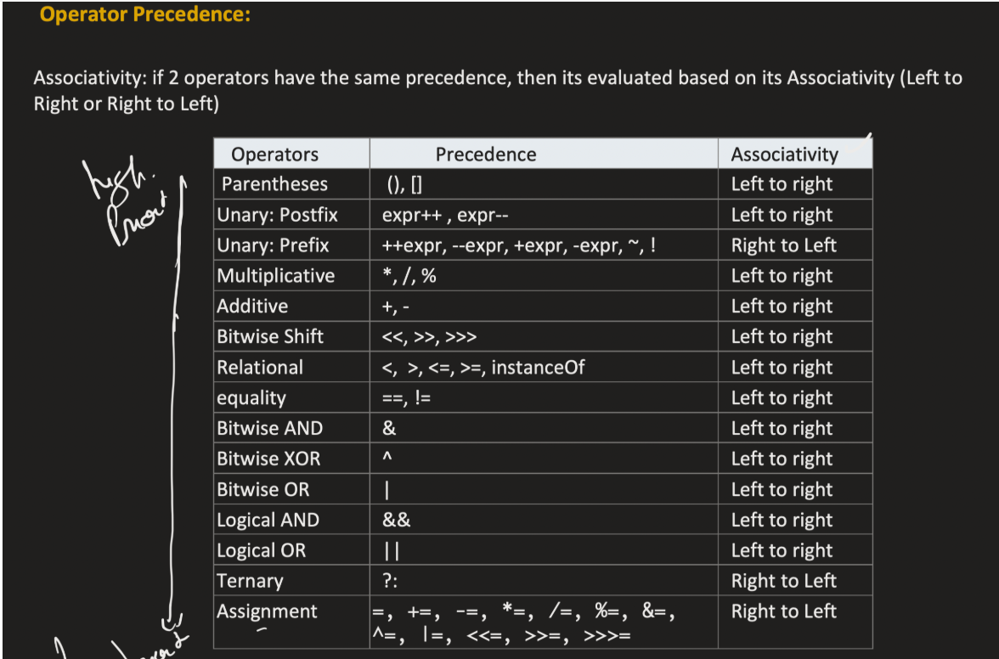
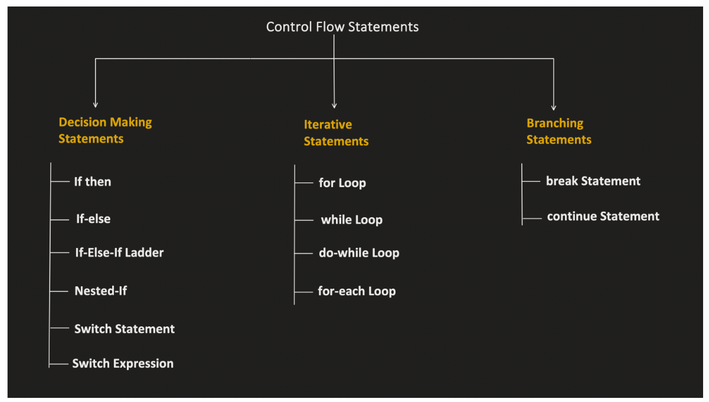

1. Operators in java 

Operator : This indicate what actions to perform like add, subtract etc 
Operand : This indicate the items, on which actions has to be performed 
Expression : It consists of more or more operand and 0 or more operator 

assocatiative rule

2. Control flow statements 

    2.1 Few things to take care for switch cases:
        - Two cases can not have the same value
        - Switch expression date type and case value/constant data type should be same 
        - Case value should either be LITERAL or CONSTANT 
        - All cases need not to be handled 
        - nested statement is possible 
        - Supported datea types :
            - 4 primitive type: int, short, byte, char 
            - Wrapper type of above primitve data types i.e. Integer, Short, Byte, Character
            - Enum
            - String 
        - Return is not within switch case 
    
    2.2 Switch Expression 
        - Using 'Case N ->' label
        - Using 'yield' statement 
        - All cases need to be handled in this case 
        - Using this '->' we can not have block of statement. 'Yeild' is used for that 