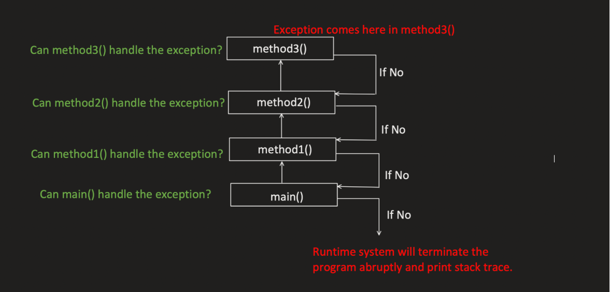
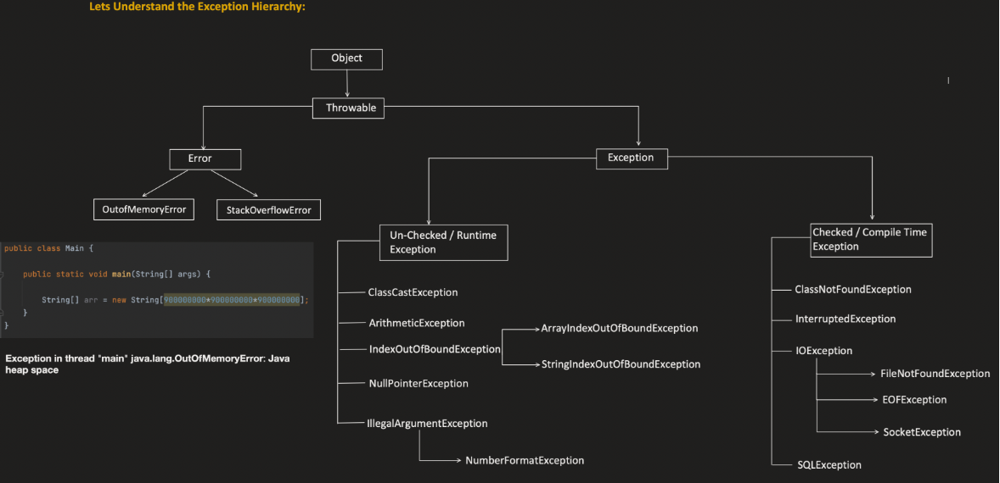

# Java Exception Handling

## 1. Why Exceptions Are Used

An exception is an event that occurs during the execution of a program and disrupts its normal flow.

- It disrupts the program's natural flow.
- It creates an **exception object**, which contains information about the error, such as:
  - The type of exception and its message
  - The stack trace
- The runtime system uses this exception object to find the class that can handle it.

## 2. Exception Hierarchy

## 3. Try, Catch, Finally

### 3.1 Try / Catch

- The `try` block specifies the code that can throw an exception.
- A `try` block must be followed by either a `catch` block or a `finally` block.
- The `catch` block is used to catch exceptions thrown in the `try` block.
- Multiple `catch` blocks can be used to handle different exception types.

### 3.2 Try / Catch / Finally or Try / Finally

- A `finally` block can be used after a `try` or `try/catch` block.
- The `finally` block always gets executed, whether you return from the `try` block or the `catch` block.
- At most, only one `finally` block can be added per `try`.
- If a JVM-related issue occurs — such as an out-of-memory error, system shutdown, or the process being forcefully killed — the `finally` block does **not** get executed.

### 3.3 Throw

- Used to throw a new exception.
- Also used to re-throw an existing exception.

### 3.4 Throws

- Used in a method signature to declare that the method might throw an exception.
- Tells the caller (parent) that it needs to handle the error.

## 4. Benefits of Exception Handling

- Keeps code clean by separating error-handling code from regular business logic.
- Allows the program to recover from errors.
- Allows additional context to be attached to errors, which helps with debugging.
- Improves security by hiding sensitive information from the user.
