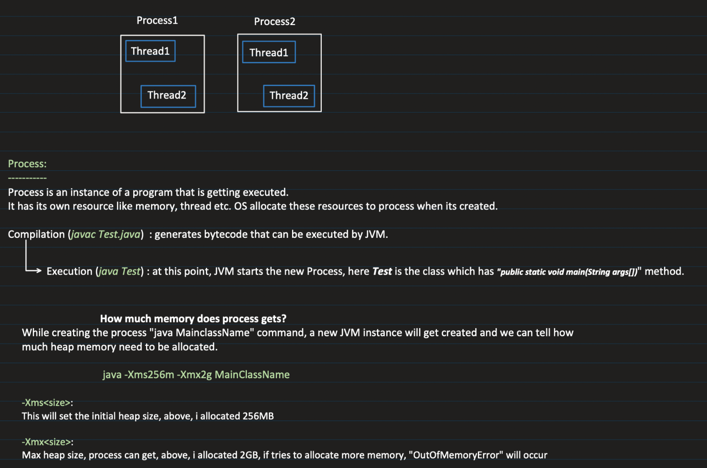
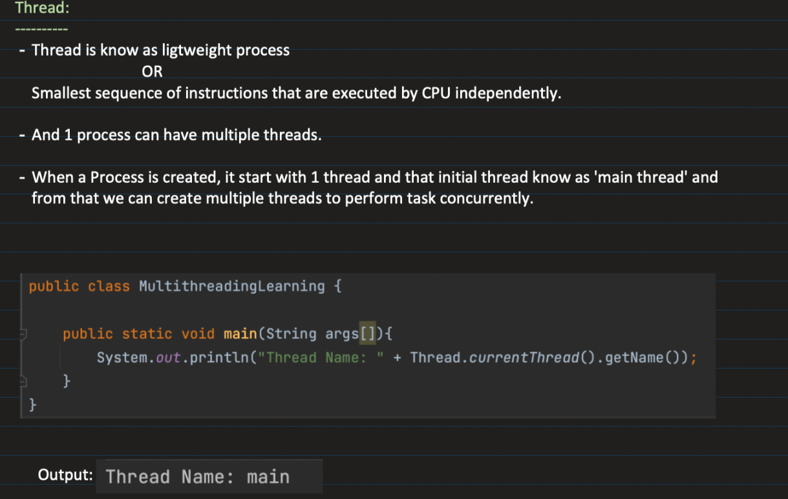
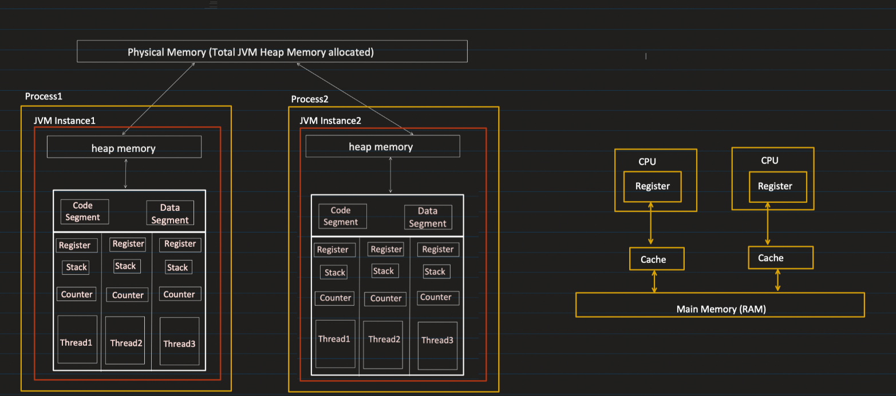
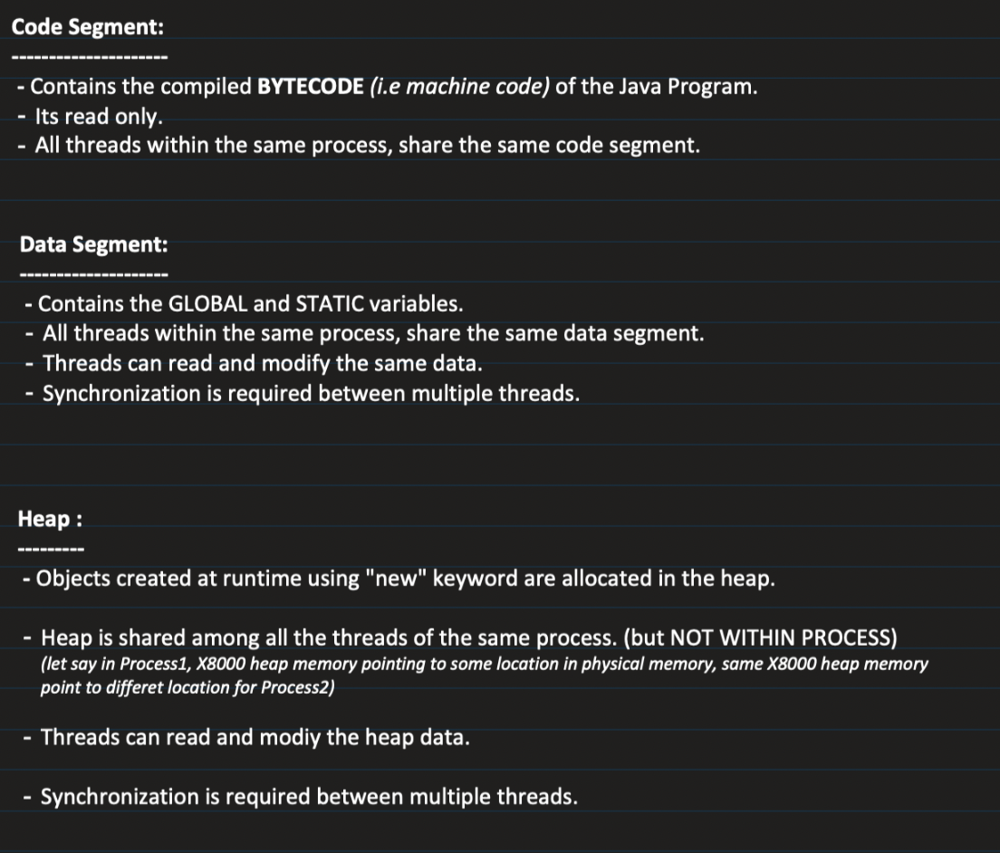
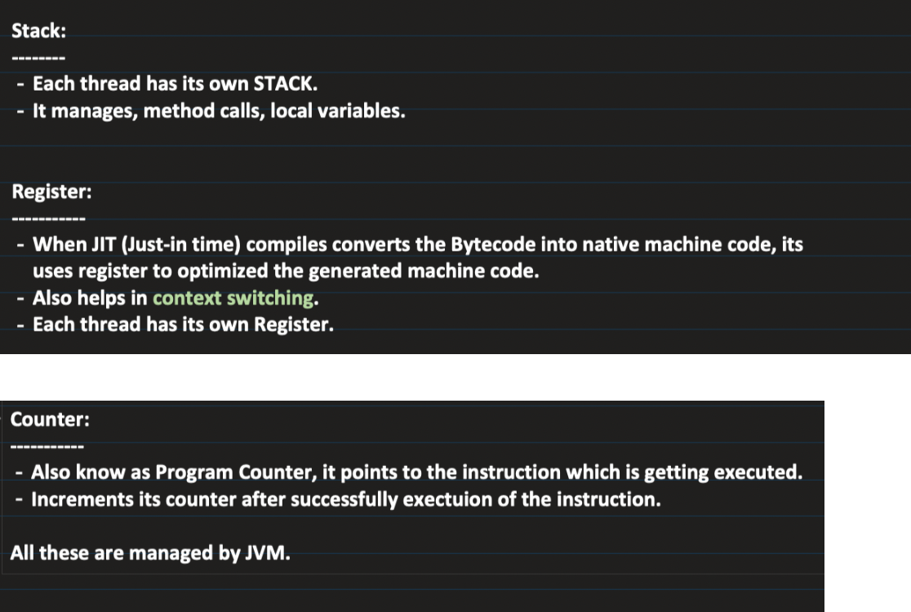
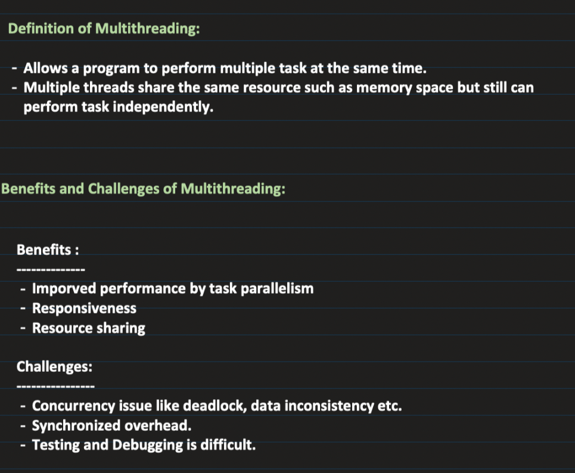

1. Process 
    

2. Thread 
    

3. Multithreading 
    

4. Multitasking vs Multithreading 
    *Multitasking* is multiple process executing at the same time 

    *Multithreading* is multiple thread within the same process getting executed at the same time 