1. What is Stream ?
    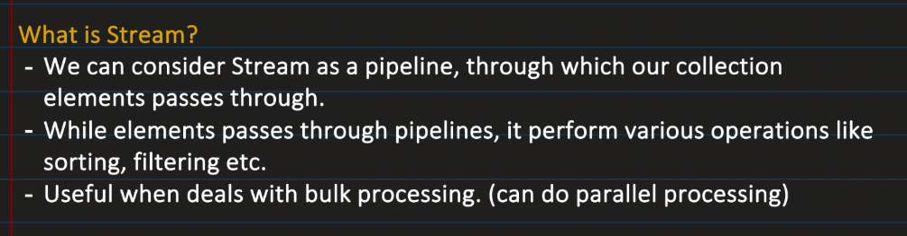
    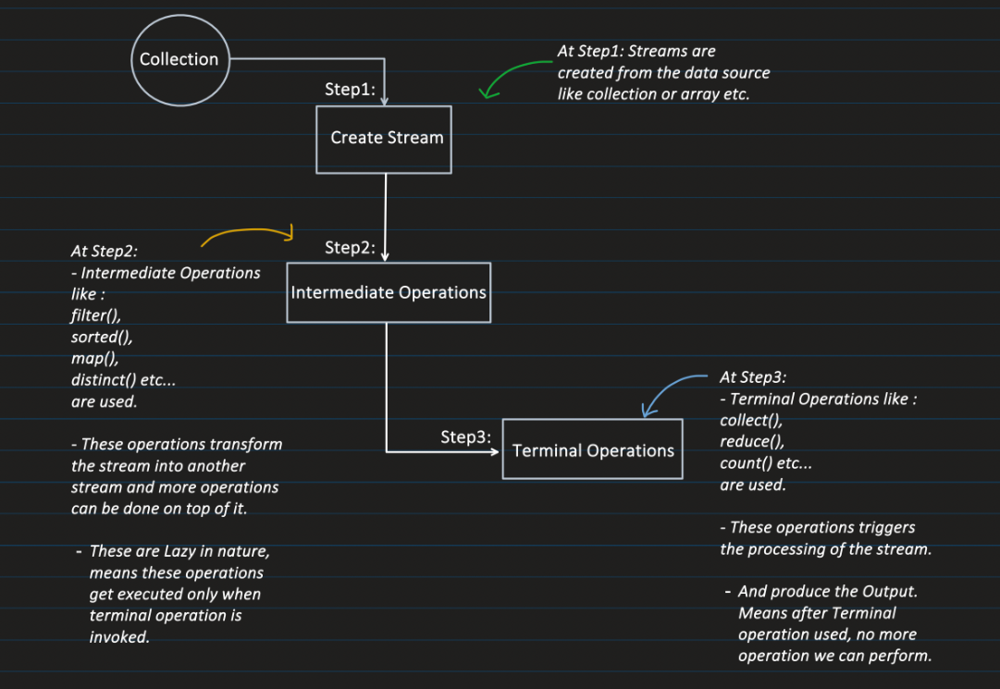

2.  Different ways of creating stream

3. Different Intermediate Operations:
    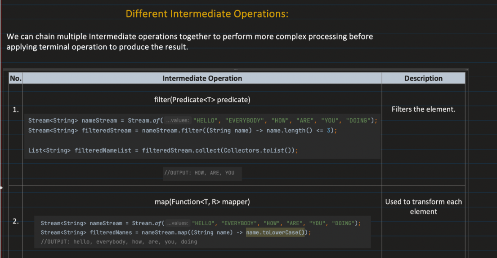
    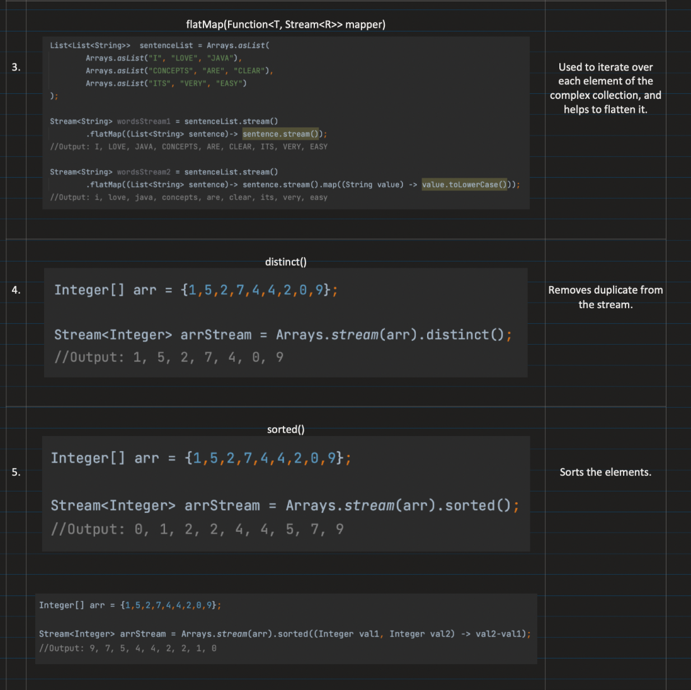
    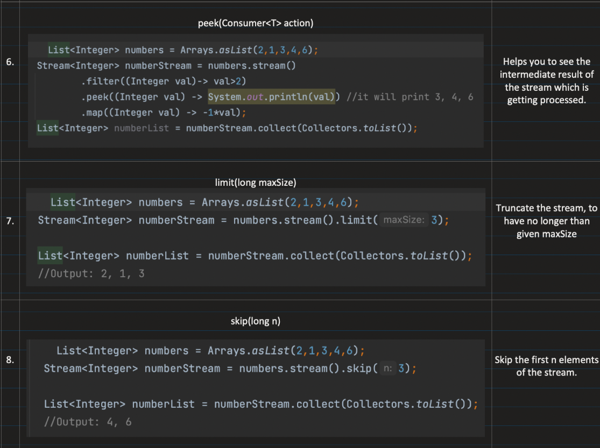
    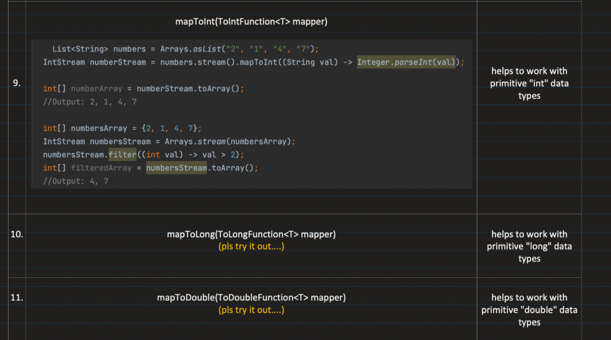

4. Why we call intermediate operation "Lazy"
    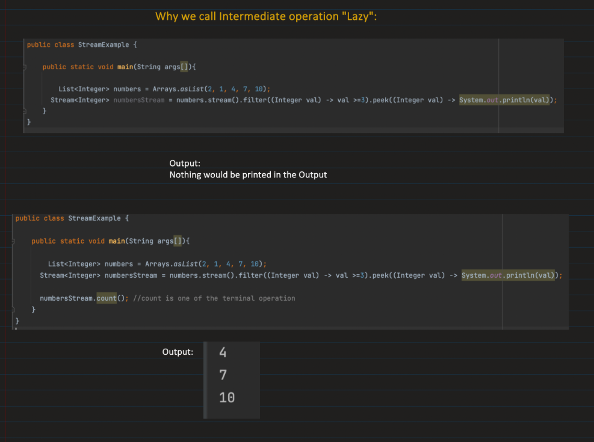

5. Sequence of stream operations:
    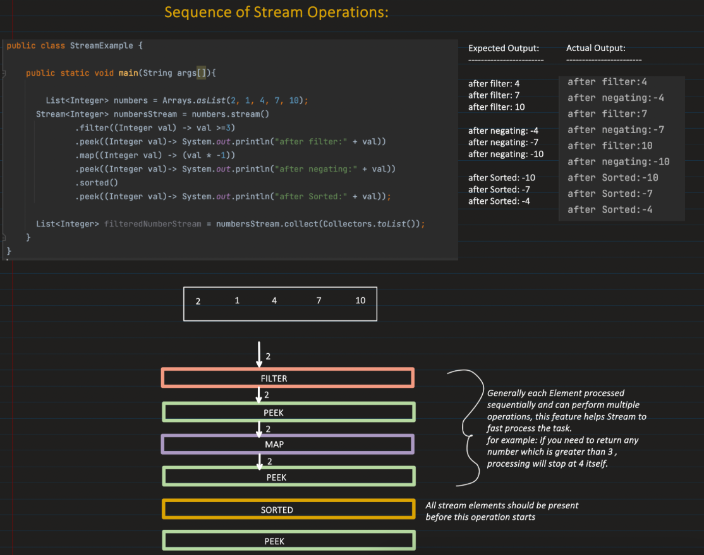

6. Different terminal operations:
    
    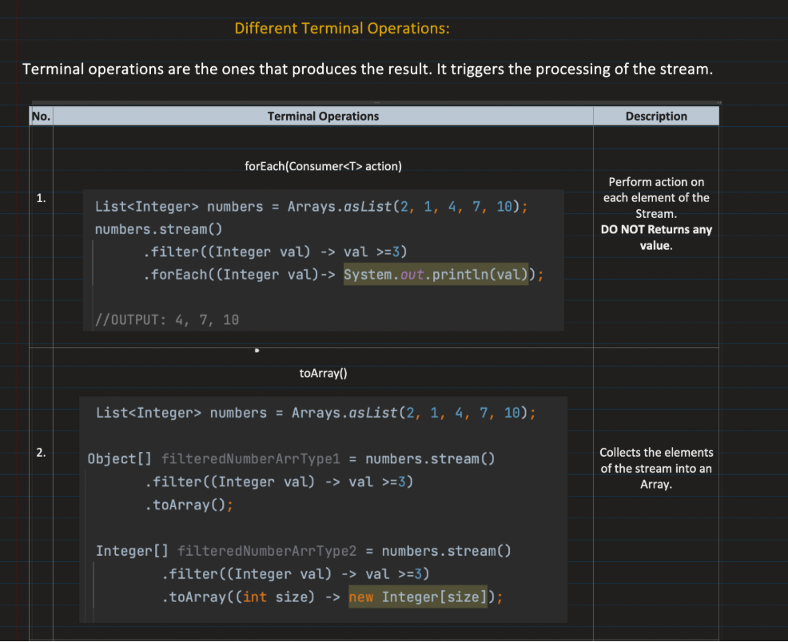
    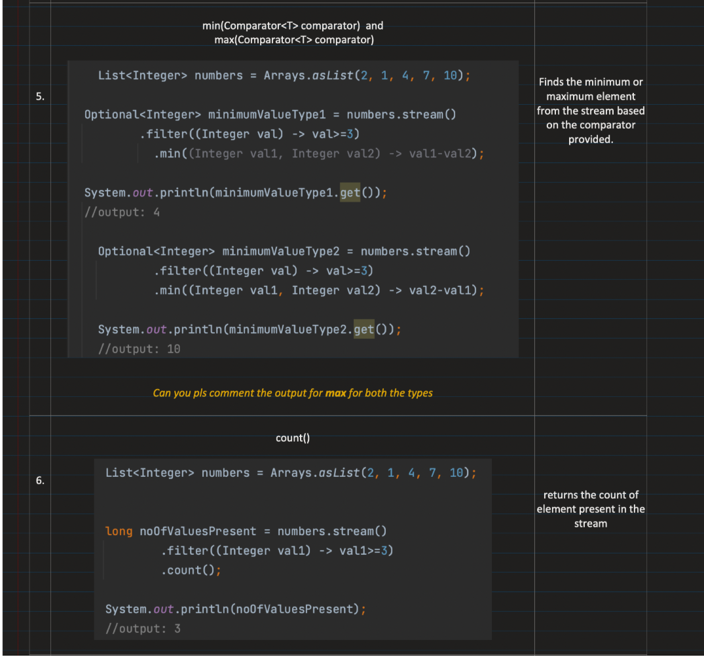
    

7. How many times we can sue a single stream:
    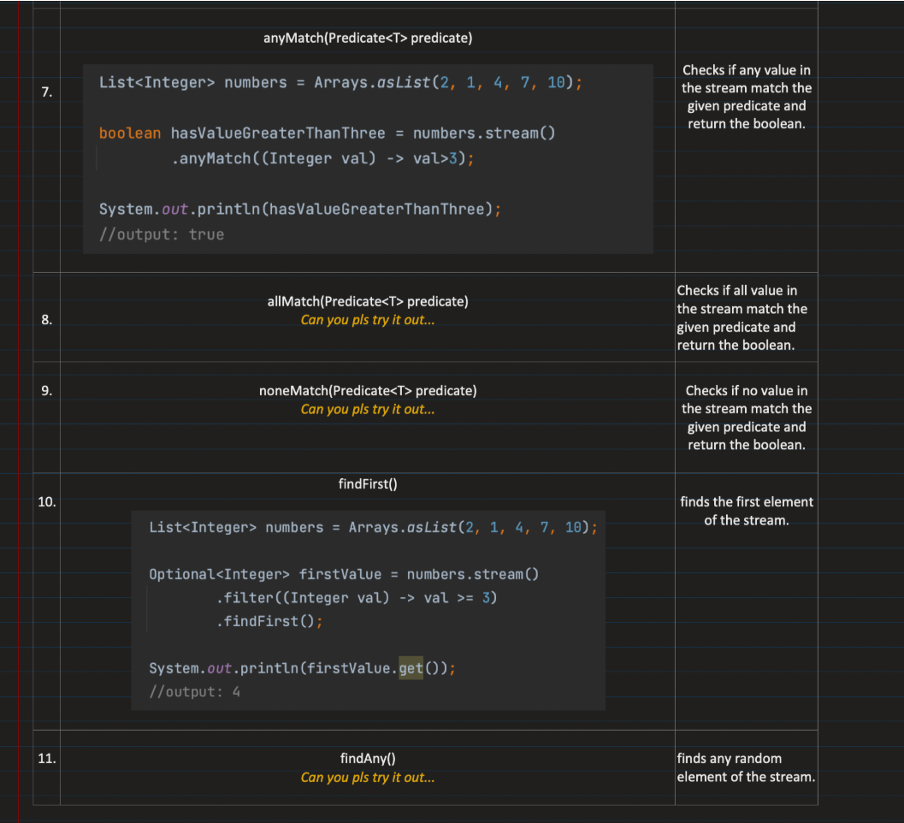

8. Parallel Stream:
    Helps to perform operation on stream concurrently, taking advantage of multi core CPU.
    ParrallelStream() method is used instead of regular stream() method.

    Internally it does: 
        - Task splitting: it uses 'spliterator' function to split the data into multiple chunks
        - Task submision and parrallel processing: Uses Fork-Join pool technique.

    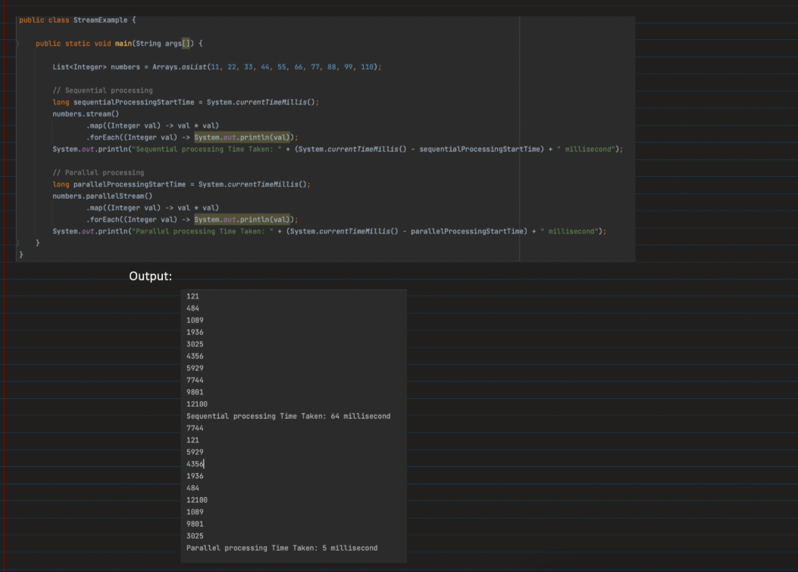  
    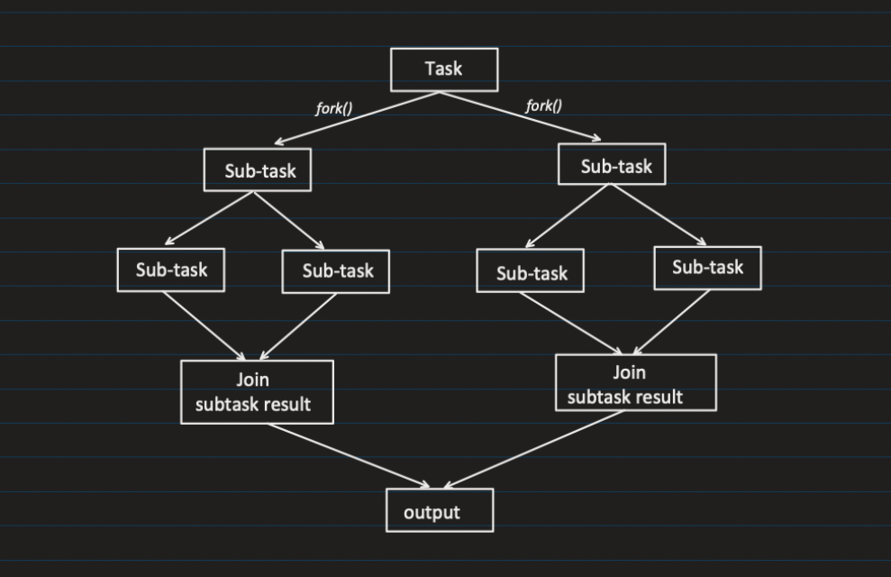